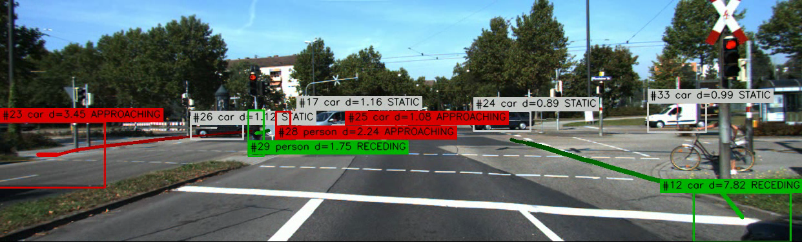
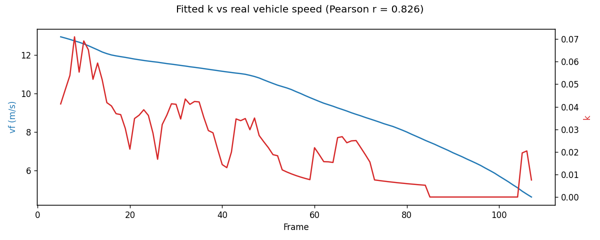
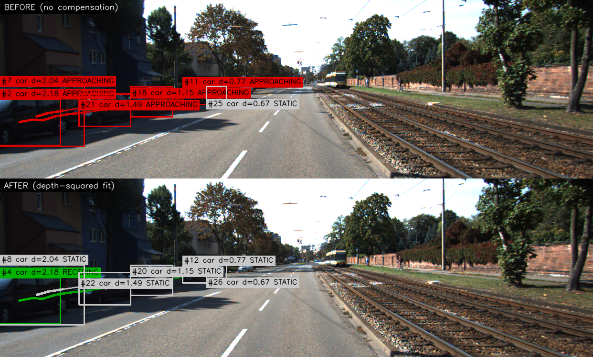
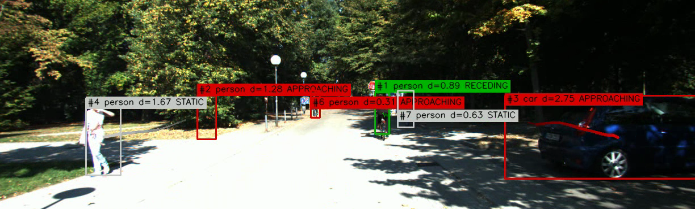

# Spatial Scene Monitor

> UCL MEng Robotics & AI — Computer Vision Portfolio Project
> **Detection:** YOLOv8n · **Tracking:** ByteTrack (class-aware) · **Depth:** Depth Anything V2 (ViT-S) · **Benchmark:** KITTI Raw

[](https://python.org)
[](https://pytorch.org)
[](https://github.com/ultralytics/ultralytics)
[](https://github.com/ifzhang/ByteTrack)
[](https://github.com/DepthAnything/Depth-Anything-V2)
[](https://www.cvlibs.net/datasets/kitti/)

---

## What was Built

A real-time monocular perception pipeline for road scenes. Given a video sequence (KITTI or webcam), it tracks every car, pedestrian, cyclist, bus, and truck in frame and assigns each one a relative depth, a depth trajectory, and a directional risk state — APPROACHING, RECEDING, or STATIC — annotated live onto the output video and logged per-frame as JSON.

**Key design decisions:**

- **Ego-motion compensation via a depth-squared scale fit.** A single moving camera cannot distinguish "I am driving toward a parked car" from "the car is driving toward me" — both produce identical increasing-disparity signatures. `FusionEngine` fits `depth_velocity = k · depth²` per frame from the population of currently tracked objects (the parallax-correct relationship for a pinhole/disparity model) and classifies risk on the residual. Validated directly against KITTI's real GPS/IMU vehicle speed — see [Results](#results).
- **Class-aware ByteTrack.** One independent tracker instance per object class, so a pedestrian can never inherit a car's track ID just because their boxes happen to overlap as one leaves frame and the other enters.
- **Per-track Kalman filter on depth, not EMA.** State `[depth, depth_velocity]` gives velocity as a first-class quantity (needed for risk scoring anyway) and degrades gracefully — a frame with no usable depth reading just predicts forward instead of corrupting the estimate.
- **Center-crop median depth extraction.** Bounding boxes always include background pixels; the central 50% of the box is far more likely to contain only the object, and median is robust to depth-map outlier spikes (reflective surfaces, thin occluders).

---

## Architecture

```
┌──────────────────────────────────────────────────────────────────────────┐
│                            PIPELINE OVERVIEW                             │
└──────────────────────────────────────────────────────────────────────────┘

   Video Frame
        │
        ├─────────────────────────────┐
        ▼                             ▼
  ┌────────────┐               ┌──────────────────┐
  │  Detector  │               │  DepthEstimator   │
  │  YOLOv8n   │               │  Depth Anything V2 │
  └─────┬──────┘               └─────────┬─────────┘
        │ List[Detection]                │ raw depth map [H×W]
        ▼                                │
  ┌────────────┐                         │
  │  Tracker   │                         │
  │  ByteTrack │                         │
  │ (per-class)│                         │
  └─────┬──────┘                         │
        │ List[TrackedObject]            │
        └───────────────┬────────────────┘
                         ▼
                ┌──────────────────┐
                │   FusionEngine    │
                │  1. normalise depth map (median anchor)
                │  2. center-crop median extraction per box
                │  3. per-track Kalman filter (depth, velocity)
                │  4. fit ego-motion scale k = median(v / depth²)
                │  5. relative_velocity = depth_velocity − k·depth²
                │  6. classify risk on relative_velocity
                └─────────┬────────┘
                          │ TrackStateStore
              ┌───────────┴────────────┐
              ▼                        ▼
       ┌─────────────┐          ┌─────────────┐
       │ Visualiser  │          │ JSONLogger  │
       │ annotated   │          │ per-frame   │
       │ frame out   │          │ .jsonl log  │
       └─────────────┘          └─────────────┘
```

---

## Results

Tested against three real KITTI Raw sequences, chosen to stress different parts of the pipeline: a quiet residential street (mostly parked cars), a campus path (pedestrian-dense), and a busy signalled intersection (mixed traffic, highest concurrency).

| Sequence | Scene | Frames | Unique Tracks | Max Concurrent | STATIC | APPROACHING | RECEDING |
|:---|:---|---:|---:|---:|---:|---:|---:|
| `2011_09_26_drive_0001` | Residential, parked cars | 108 | 11 (10 car, 1 person) | 6 | 57.8% | 14.4% | 27.8% |
| `2011_09_28_drive_0047` | Campus, pedestrians | 31 | 9 (7 person, 2 car) | 6 | 32.8% | 36.5% | 30.7% |
| `2011_09_26_drive_0011` | Busy signalled intersection | 233 | 25 (16 car, 3 person, 2 bus, 3 truck, 1 bicycle) | 9 | 54.4% | 25.2% | 20.4% |



**Throughput:** ~0.27–0.29 s/frame end-to-end (detection + tracking + depth + fusion + render) on an Apple M4 Pro (MPS), consistent across both the 108-frame and 233-frame sequences.

### Ego-motion compensation: validated against real GPS, not just internally consistent

KITTI ships real recorded vehicle speed (`oxts` GPS/IMU log, field `vf`) alongside the camera frames, unused by the project elsewhere. `scripts/validate_ego_motion.py` compares the fitted ego-motion scale `k` against real `vf` over a full sequence:

**Pearson correlation: r = 0.826**



The two curves track the vehicle's real deceleration from ~13 m/s to ~5 m/s across the sequence — strong evidence `k` is recovering genuine ego-motion from the scene, not producing a plausible-looking but unfounded number.

### Effect of ego-motion compensation on false positives

Risk distribution on `2011_09_26_drive_0001` (parked cars only — nothing in this sequence is actually moving) across each iteration of the fix:

| Model | STATIC | APPROACHING | RECEDING |
|:---|---:|---:|---:|
| No compensation (raw `depth_velocity`) | 63 | 250 | 0 |
| Flat median-velocity baseline | 125 | 99 | 89 |
| Depth-squared parallax-aware fit (final) | 181 | 45 | 87 |

Every object in this sequence is parked. With no compensation, every car a moving camera approached was flagged APPROACHING for its entire time in frame — a 0% true-negative rate on stationary objects. The final model reduces false APPROACHING flags by 82% relative to the uncompensated baseline.



### Test suite

24/24 tests passing (`pytest tests/`) across detector parsing, depth extraction/normalisation, Kalman filter convergence and noise rejection, and fusion engine risk classification — including the depth-squared ego-motion model exercised against physically self-consistent synthetic trajectories.



---

## Key Findings

**Motion parallax breaks a flat ego-motion offset.** A stationary object's own depth-velocity from ego-motion alone scales with the *square* of how close it already is — nearby parked cars sweep past faster than distant ones at the same vehicle speed. A single shared offset (first iteration) measurably improved things but still misclassified two equally-parked cars differently purely because they sat at different distances. Fitting `k` against `depth²` instead of a flat number fixed this.

**A synthetic test silently violated the model's own physics.** An early test for the depth-squared model used linear depth growth for its "background" tracks — not a solution to the model's `dD/dt = k·D²` relationship. It passed initially, then silently flipped sign after the foreground track's depth diverged far enough that the squared extrapolation overshot. Rebuilding the test data from the equation's actual closed-form solution fixed it, and is now documented directly in `tests/test_fusion.py` as a worked example.

**Real footage surfaced two Visualiser bugs synthetic boxes never would have.** A dense cluster of parked cars produced unreadable overlapping label badges; a track near the frame's right edge had its label clipped mid-word. Both were fixed (greedy vertical collision avoidance, horizontal clamping) and re-verified against the exact frames that exposed them.

**KITTI's native resolution (1242×375) silently broke video encoding.** 375 is odd; codecs using YUV420 chroma subsampling require even dimensions and truncate rather than error. Confirmed directly — a 375-tall frame read back as 374 — and fixed by padding to the nearest even size before writing, not by cropping.

**A single tracked object cannot have its motion classified.** With fewer than two tracks, the median fit for `k` collapses to that one track's own ratio, making its `relative_velocity` always exactly zero. This is an inherent limitation of inferring ego-motion from object motion alone (no IMU/visual odometry is wired into the runtime path) and degrades gracefully rather than failing.

---

## Reproduction

```bash
git clone https://github.com/JesonRamesh/Spatial-Scene-Monitor
cd Spatial-Scene-Monitor

pip install -r requirements.txt
scripts/setup_depth_anything.sh        # fetches Depth Anything V2 code + ViT-S checkpoint

python main.py --source <kitti_sequence_dir_or_video_or_webcam_index>
pytest tests/                          # 24 tests
scripts/validate_ego_motion.py --source <kitti_sequence_dir>   # needs oxts/data/
```

`configs/default.yaml` is the single source of truth for every tunable parameter (detection thresholds, tracking buffer, Kalman noise, risk threshold, output paths).

---

## Repository Structure

```
spatial-scene-monitor/
├── main.py                              # entry point — wires every module, no business logic
├── configs/default.yaml                 # all tunable parameters
├── modules/
│   ├── detection/detector.py            # YOLOv8 wrapper, road-class filter, device routing
│   ├── tracking/tracker.py              # class-aware ByteTrack wrapper
│   ├── depth/
│   │   ├── depth_estimator.py           # Depth Anything V2 wrapper
│   │   └── depth_utils.py               # center-crop median extraction, per-frame normalisation
│   ├── fusion/
│   │   ├── data_types.py                # Detection, TrackedObject, TrackState, RiskLevel
│   │   ├── track_kalman.py              # per-track 1D Kalman filter on depth
│   │   └── fusion_engine.py             # TrackStateStore owner, ego-motion compensation, risk
│   ├── visualisation/visualiser.py      # frame annotation — boxes, badges, pseudo-3D trails
│   └── utils/
│       ├── kitti_loader.py              # KITTI sequence iterator (VideoCapture-compatible)
│       ├── logger.py                    # per-sequence JSON Lines log writer
│       └── video_writer.py              # codec-fallback, even-dimension-padded video writer
├── scripts/
│   ├── setup_depth_anything.sh          # fetches model code + checkpoint
│   └── validate_ego_motion.py           # correlates fitted k against real KITTI vehicle speed
└── tests/                               # pytest suite, 24 tests
```

---

## References

1. Zhang, Y. et al. (2022). **ByteTrack: Multi-Object Tracking by Associating Every Detection Box**. ECCV 2022. [arXiv:2110.06864](https://arxiv.org/abs/2110.06864)
2. Jocher, G. et al. (2023). **Ultralytics YOLOv8**. [GitHub](https://github.com/ultralytics/ultralytics)
3. Yang, L. et al. (2024). **Depth Anything V2**. [arXiv:2406.09414](https://arxiv.org/abs/2406.09414)
4. Geiger, A. et al. (2013). **Vision meets Robotics: The KITTI Dataset**. IJRR. [cvlibs.net/datasets/kitti](https://www.cvlibs.net/datasets/kitti/)
